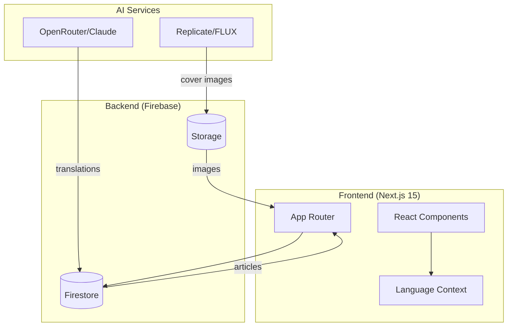
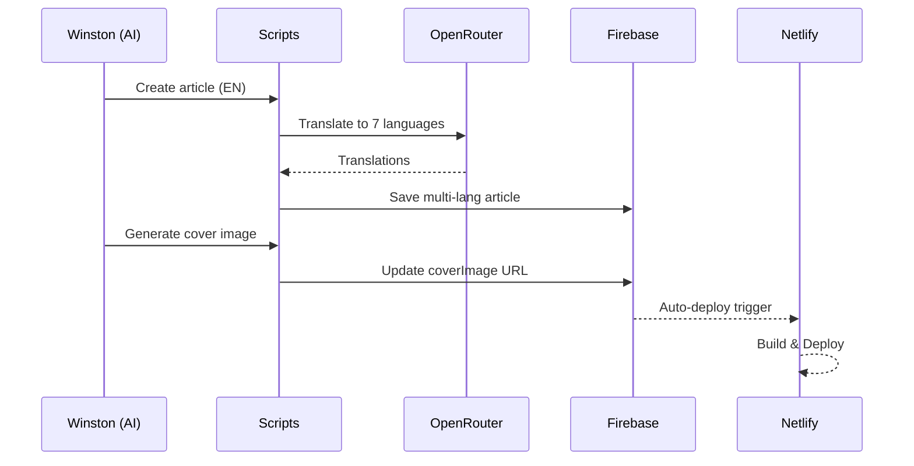
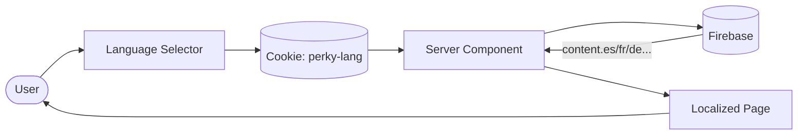

# Perky News 🐧

Your source for Web3 AI ecosystem news. Covering x402, ERC-8004, AI agents, and the infrastructure powering the agent economy.

**Live:** [https://perky.news](https://perky.news)

## Features

- 🌐 **8 Languages** - EN, ES, FR, IT, DE, JA, KO, ZH
- 🤖 **AI-Powered Content** - Articles generated and translated via Claude
- 🖼️ **Professional Images** - Cover images generated with FLUX 1.1 Pro
- 🔥 **Firebase Backend** - Firestore for articles, real-time updates
- ⚡ **Next.js 15** - App Router, Server Components
- 🎨 **Tailwind CSS v4** - Modern styling
- 📱 **Mobile Responsive** - Works on all devices

## Architecture



## Content Workflow



## Multi-Language Flow



## Project Structure

```
perky-news/
├── App/                    # Next.js web application
│   ├── src/
│   │   ├── app/           # App Router pages
│   │   ├── components/    # React components
│   │   └── lib/           # Utilities & Firebase
│   └── scripts/           # Content management
│       ├── create-article.mjs      # Create + auto-translate
│       ├── translate-article.mjs   # Translate existing
│       └── generate-article-images.mjs  # FLUX image gen
├── Contracts/              # Smart contracts (coming soon)
└── README.md
```

## Quick Start

```bash
cd App
npm install
npm run dev
```

Open [http://localhost:3000](http://localhost:3000)

## Content Workflow

### Create New Article (with auto-translation)
```bash
cd App
node scripts/create-article.mjs article.json
```

Articles are automatically translated to 7 languages via OpenRouter.

### Generate Cover Images
```bash
REPLICATE_API_TOKEN=xxx node scripts/generate-article-images.mjs
```

## Multi-Language Support

| Code | Language |
|------|----------|
| en | English |
| es | Spanish |
| fr | French |
| it | Italian |
| de | German |
| ja | Japanese |
| ko | Korean |
| zh | Chinese (Simplified) |

Users select language from the header dropdown. Preference is saved in a cookie.

## Topics Covered

- 💰 **x402 Protocol** - HTTP-native payments
- 🔐 **ERC-8004** - Trustless agent identity
- 🤖 **AI Agents** - Autonomous AI systems
- 🌐 **A2A Protocol** - Agent-to-agent communication
- 🏗️ **Agent Stack** - A2A + MCP + x402 + ERC-8004
- 🏆 **Hackathons** - ETHGlobal events calendar

## Tech Stack

- **Frontend:** Next.js 15, React 19, Tailwind CSS v4
- **Backend:** Firebase (Firestore)
- **Hosting:** Netlify
- **AI:** OpenRouter (Claude) for translations
- **Images:** Replicate (FLUX 1.1 Pro)

## Environment Variables

```bash
# Firebase
NEXT_PUBLIC_FIREBASE_API_KEY=
NEXT_PUBLIC_FIREBASE_AUTH_DOMAIN=
NEXT_PUBLIC_FIREBASE_PROJECT_ID=
NEXT_PUBLIC_FIREBASE_STORAGE_BUCKET=
NEXT_PUBLIC_FIREBASE_MESSAGING_SENDER_ID=
NEXT_PUBLIC_FIREBASE_APP_ID=

# Scripts (local only)
OPENROUTER_API_KEY=     # For translations
REPLICATE_API_TOKEN=    # For image generation
FIREBASE_SA_PATH=       # Service account path
```

## Part of PerkOS

Perky News is part of the [PerkOS](https://github.com/PerkOS-xyz) ecosystem.

## License

MIT
